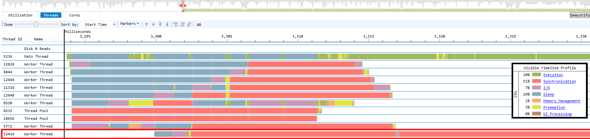

> # Project N
> 
> - to study a multi-play game server

> # Index
> 
> - [Precompiled Headers](#precompiled-headers)
> - [I/O Completion Ports](#i/o-completion-ports)
> - [Packet Serialization](#Packet-Serialization)
> - [Open Database Connectivity](#Open-Database-Connectivity)
> - [DB Class](#DB-Class)

# Precompiled Headers

> 
> 
> 설정을 잘 완료 했으면 프로젝트 빌드 부산물 중에서 미리컴파일된헤더 파일이 생긴다.

# I/O Completion Ports

> [Microsoft Docs]([I/O Completion Ports - Win32 apps | Microsoft Learn](https://learn.microsoft.com/en-us/windows/win32/fileio/i-o-completion-ports))
> 
> 1. I/O Completion Ports가 무엇인가?
> 
> > 여러 개의 비동기적인 요청을 효율적으로 처리하는 모델이다.
> > 
> > 구체적으로 미리 할당 된 스레드 풀을 가지고 있고, 큐를 통해서 작업을 받아서 처리한다.
> 
> 2. IOCP는 어떻게 사용할까?
> 
> > `CreateIoCompletionPort` 함수를 이용해서 IOCP를 만들면 핸들값을 얻을 수 있다. 그리고 소켓을 만들어 등록하고, `CompletionKey`를 통해서 그 소켓을 식별할 수 있다.
> > 
> > 그 소켓에 대한 비동기적인 요청을 실행하기 위해서 `OVERLAPPED`구조체를 넣어준다. I/O에 대한 정보가 `OVERLAPPED`구조체에 담긴다. 
> > 
> > 마지막으로 `GetQueuedCompletionStatus`를 통해서 완료된 요청을 받아서 원하는 작업을 하면 된다.
> 
> 3. 실제로 확인해 보기
> 
> 
> 
> > 코드 흐름
> > 
> > 1. 클라이언트로 연결을 하고 Recv를 한다.
> > 
> > 2. 워커 스레드 8개를 생성한다.
> > 
> > 3. IOCP에서 GQCS를 통해서 받은 정보를 받는다.
> > 
> > 4. 다시 Recv를 한다.
> > 
> > 여기서 접속한 클라이언트는 1개다. IOCP의 대기 스레드 큐는 LIFO이므로 워커 스레드 중에 하나만 계속 동작하고 있다.  

# Packet Serialization

> 클라이언트에서 패킷을 보내면 그 패킷을 활용해서 서버 서비스를 구현한다.
> 
> 1. 구조체를 활용한 직렬화
> 
> > `#pragma pack(push, 1)`, `#pragma pack(pop)`을 이용해서 alignment를 1BYTE로 한다.
> > 
> > 받은 버퍼에 해당하는 구조체 포인터로 읽으면 클라이언트에 보낸 패킷을 그대로 활용할 수 있다.
> > 
> > 단순한 만큼 직렬화에 대한 클럭 소모가 없다.
> > 
> > 클라이언트를 UE4를 이용해서 만들었기 때문에 간단하게 패킷 직렬화를 했지만, 다른 자료형을 갖는 플렛폼과 언어를 사용할 시 이와 같은 방법은 사용하기에 적합하지 않다.

# Open Database Connectivity

> ODBC : 프로세스가 다양한 데이터베이스에 접근할 수 있도록 해주는  C 인터페이스 
> 
> > ```cpp
> > // Open Database Connectivity(ODBC)
> > 
> > // Master include file for Windows applications
> > #include <Windows.h>
> > 
> > // This file defines the types used in ODBC
> > #include <sqltypes.h>
> > 
> > //  This is the the main include for ODBC Core functions.
> > #include <sql.h>
> > 
> > // This is the include for applications using the Microsoft SQL Extensions
> > #include <sqlext.h>
> > 
> > #include <iostream>
> > 
> > int main()
> > {
> > 
> >     // typedef SQLHANDLE
> >     // ODBC 환경 핸들
> >     SQLHENV henv;
> > 
> >     // 환경 핸들 할당하기
> >     // parameters -> typedef short SQLSMALLINT, SQLHANDLE, SQLHANDLE*
> >     // return - > SQL_SUCCESS, SQL_SUCCESS_WITH_INFO, SQL_INVALID_HANDLE, or SQL_ERROR.
> >     SQLRETURN ret = SQLAllocHandle(SQL_HANDLE_ENV, SQL_NULL_HANDLE, &henv);
> >     if (ret == SQL_ERROR || ret == SQL_INVALID_HANDLE)
> >     {
> >         std::wcout << L"henv : SQLAllocHandle - SQL_INVALID_HANDLE or SQL_ERROR.\n";
> >     }
> > 
> >     // ODBC 버전 설정
> >     // parameters - > SQLHENV, SQLINTEGER, SQLPOINTER, SQLINTEGER
> >     // return - > SQL_SUCCESS, SQL_SUCCESS_WITH_INFO, SQL_ERROR, or SQL_INVALID_HANDLE.
> >     ret = SQLSetEnvAttr(henv, SQL_ATTR_ODBC_VERSION, (void*)SQL_OV_ODBC3, 0);
> >     if (ret == SQL_ERROR || ret == SQL_INVALID_HANDLE)
> >     {
> >         std::wcout << L"SQLSetEnvAttr - SQL_ERROR or SQL_INVALID_HANDLE\n";
> >     }
> > 
> >     // DB 연결 핸들 설정
> >     SQLHDBC hdbc;
> >     ret = SQLAllocHandle(SQL_HANDLE_DBC, henv, &hdbc);
> >     if (ret == SQL_ERROR || ret == SQL_INVALID_HANDLE)
> >     {
> >         std::wcout << L"hdbc : SQLAllocHandle - SQL_INVALID_HANDLE or SQL_ERROR.\n";
> >     }
> >     // 연결 문자열 만들기
> >     // DSN 이용해서 연결하기
> >     SQLWCHAR* connectionString = (SQLWCHAR*)L"DRIVER={SQL Server};SERVER=localhost, 1433;DSN=newbieDB;UID=sa;PWD=test;";
> > 
> >     // DB에 연결
> >     // return -> SQL_SUCCESS, SQL_SUCCESS_WITH_INFO, SQL_NO_DATA, SQL_ERROR, SQL_INVALID_HANDLE, or SQL_STILL_EXECUTING.
> >     ret = SQLDriverConnectW(hdbc, NULL, connectionString, SQL_NTS, NULL, 0, NULL, SQL_DRIVER_COMPLETE);
> >     if (ret == SQL_ERROR || ret == SQL_INVALID_HANDLE || ret == SQL_STILL_EXECUTING)
> >     {
> >         std::wcout << L"SQLDriverConnectW - SQL_ERROR, SQL_INVALID_HANDLE, or SQL_STILL_EXECUTING.\n";
> >     }
> > 
> >     // 명령문 핸들 생성
> >     // statement
> >     SQLHSTMT hstmt;
> >     ret = SQLAllocHandle(SQL_HANDLE_STMT, hdbc, &hstmt);
> >     if (ret == SQL_ERROR || ret == SQL_INVALID_HANDLE)
> >     {
> >         std::wcout << L"hstmt : SQLAllocHandle - SQL_INVALID_HANDLE or SQL_ERROR.\n";
> >     }
> >     // SQL statement 만들고 받아오기 
> >     SQLWCHAR statementText[] = L"SELECT * FROM Users";
> >     ret = SQLExecDirectW(hstmt, statementText, SQL_NTS);
> > 
> >     // 결과 출력
> >     if (ret == SQL_SUCCESS || ret == SQL_SUCCESS_WITH_INFO)
> >     {
> >         SQLINTEGER ID;
> >         SQLWCHAR Password[50];
> >         while (SQLFetch(hstmt) == SQL_SUCCESS)
> >         {
> >             SQLGetData(hstmt, 1, SQL_C_LONG, &ID, sizeof(ID), NULL);
> >             SQLGetData(hstmt, 2, SQL_C_WCHAR, Password, 50, NULL);
> >             std::wcout << L"ID : " << ID << L"| Password : " << Password << L"\n";
> >         }
> >     }
> > 
> >     // 명령문 핸들 해제하기
> >     if (hstmt) {
> >         SQLFreeHandle(SQL_HANDLE_STMT, hstmt);
> >         hstmt = NULL;
> >     }
> >     // DB 연결 해제, 핸들 해제하기
> >     if (hdbc) {
> >         SQLDisconnect(hdbc);
> >         SQLFreeHandle(SQL_HANDLE_DBC, hdbc);
> >         hdbc = NULL;
> >     }
> >     // 환경 핸들 해제하기
> >     if (henv)
> >     {
> >         SQLFreeHandle(SQL_HANDLE_ENV, henv);
> >         henv = NULL;
> >     }
> >     return 0;
> > }
> > ```
> > 
> > 코드를 보면 핸들을 해제하는 경우가 많다. RAII를 적용해서 객체로 설계하면 리소스 해제를 까먹지 않고 할 수 있을 것 같다.
> > 
> > 큰 흐름에서 DB사용은 서버의 수명하고 일치한다. 그래서 처음 서버가 시작할 때 리소스(핸들)을 받고, 서버를 종료하면 같이 리소스(핸들)을 반환하는 것이 흐름에 맞을 것 같다.

# DB Class

> DB 제어를 위한 클래스 만들기(RAII)
> 
> > ```cpp
> > class DB
> > {
> > public:
> >     DB();
> >     ~DB();
> >     // 초기화 실패시 -1
> >     int init();
> >     // 쿼리 요청
> >     void requestQuery(SQLWCHAR query[]);
> >     UINT32 getState() { return state; };
> > 
> > private:
> >     SQLHENV henv = nullptr;
> >     SQLHDBC hdbc = nullptr;
> >     SQLHSTMT hstmt = nullptr;
> > 
> > 
> >     // state table
> >     enum : UINT32
> >     {
> >         DBOFF,
> >         DBON,
> >         DBERROR,
> > 
> >     };
> >     // no thread safety
> >     UINT32 state = DBOFF;
> > };
> > ```
> > 
> > DB 상태에 따라 제어 가능하게 만들어야한다.
> > 
> > 만약 DB에 접근할 수 없는 경우 심각한 장애가 발생한 것이므로 게임 서버는 종료해야 한다.
> > 
> > 한 리소스에 다중 접근하기 때문에 thread safety하게 만들어야 한다.
> > 
> > 
> > 
> > 1차 목표로 mutex를 사용해서 개발을 할 예정이다.
